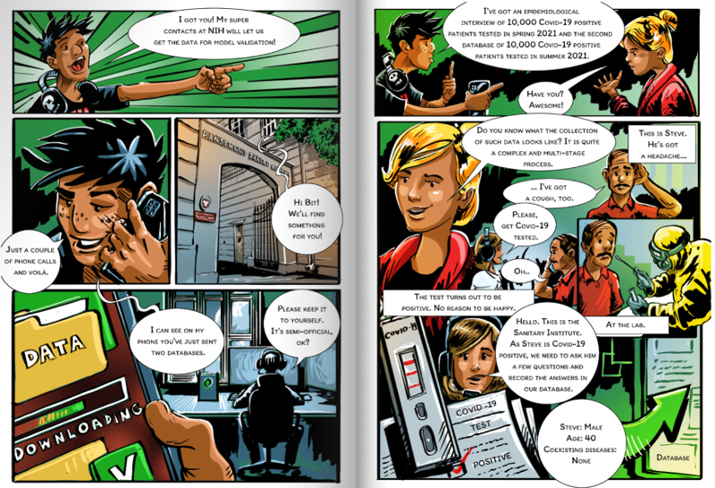
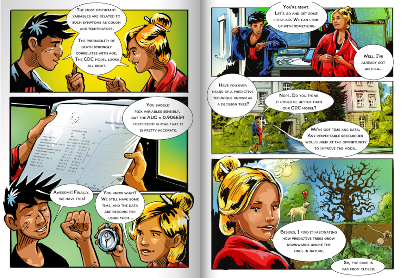
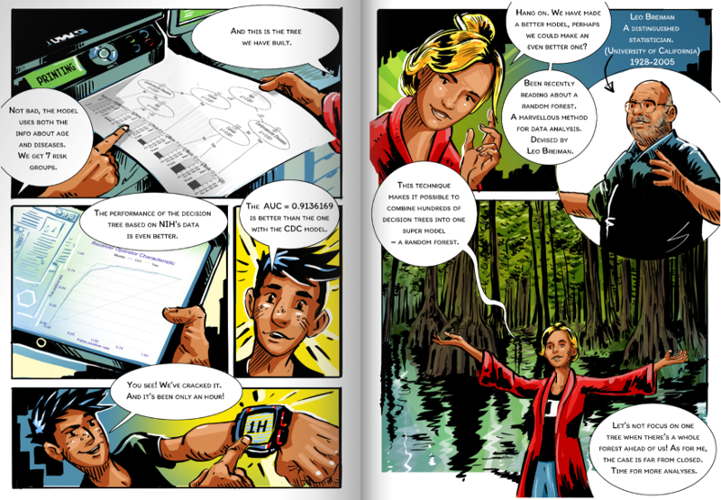

```{r setup, include=FALSE, echo=FALSE}
knitr::opts_chunk$set(echo = TRUE)
```


# *Part 1: Introduction*


## About the team

Meet your guide to ResponsibleML

- **Przemyslaw Biecek**, professor of machine learning, works at the Warsaw University of Technology and will lead the workshop in English. LI: https://www.linkedin.com/in/pbiecek/
- **Juan Correra**, Full Professor in Colegio de Estudios Superiores de Administración, will conduct a workshop in Spanish. LI: https://www.linkedin.com/in/juan-c-correa-66958544/
- **Anna Kozak**, an assistant at the Warsaw University of Technology, will conduct the workshop in Polish. LI: https://www.linkedin.com/in/kozakanna/
- **Ly Thien**, a student at the Warsaw University of Technology, will conduct a workshop in Vietnamese. LI:   https://www.linkedin.com/in/hthienly/
- **Mustafa Cavus**, a postdoc at Warsaw University of Technology, will lead a workshop in Turkish. LI: https://www.linkedin.com/in/mustafacavusphd/


## Agenda

Feel free to post any questions during the workshop on slack or in the chat. From time to time we will approach these questions.

- 16:00 About the team
- 16:10 Agenda + motivation
- 16:20 EDA
- 16:30 Let's train some models
- 16:40 Evaluate performance + examples
- 16:50 **Do it yourself**
- 17:00 XAI piramide - introduction
- 17:10 Permutational Variable Importance  + examples
- 17:20 **Do it yourself**

- 17:30 *BREAK*

- 18:00 Break-down + examples
- 18:10 SHAP + examples
- 18:20 **Do it yourself**
- 18:30 Ceteris Paribus + examples
- 18:40 Partial Dependence Profile + examples
- 18:50 **Do it yourself**
- 19:00 modelStudio + examples
- 19:10 **Do it yourself**
- 19:20 Closing remarks


## Design Principles

This workshop aims to present a set of methods for the exploration of complex predictive models.
We assume that participants are familiar with R and have some basic knowledge of predictive models. In this workshop, we will show how to explore these models.

The workshop consists of 1/3 lecture, 1/3 code examples discussed by the tutor and 1/3 computer-based exercises for participants. 

As the group is large, it may happen that someone will have some problems with the tasks, in such a situation please write about it in the chat or on the slack.

It may also happen that someone will do the tasks much earlier. In such a situation it would be best to help others who have questions on slack.

## Materials

<center></center>


The workshop is based on material from a comic book on Responsible Machine Learning. This book can be accessed online and is also available in paperback on amazon and lulu.

- English. *The Hitchhiker’s Guide to Responsible Machine Learning.* https://betaandbit.github.io/rml/
- Spanish. *La Guía del Viajero al Aprendizaje Automático Responsable.* https://betaandbit.github.io/RML_ES/
- Polish. *Wprowadzenie do Modelowania Predykcyjnego.* https://betaandbit.github.io/miniml/
- Vietnamese. *4.0.1 Cùng xây dựng Model Machine Learning với Bêta và Bít.* https://betaandbit.github.io/RML_VN/
- Turkish. *Sorumlu Makine Öğrenmesi Rehberi.* https://github.com/BetaAndBit/RML_TR


# Part 1: Introduction to predictive modelling + EDA

Get prepared. Install the following packages.

```
install.packages(c("tableone", "DALEX", "ggplot2", "partykit", "ranger", "rms"))
```


The purpose of this tutorial is to **present techniques for model exploration, visualisation and explanation**. To do this we will use some interesting real-world data, train a few models on the data and then use **XAI** (eXplainable artificial intelligence) techniques to explore these models. Along the way, we will tackle various interesting topics such as model training, model verification, model visualisation, model comparison and exploratory model analysis. 

**We assume that users have some basic knowledge about predictive modelling so we can focus on model exploration.** If you want to learn models about models, then some in-depth introduction in [An Introduction to Statistical Learning: with Applications in R](https://www.statlearning.com/). In this tutorial we will present some basics of model explanatory analysis, if you are looking for details then you will find them in  [Explanatory Model Analysis](http://ema.drwhy.ai/). 


*Why should I care?*

Predictive models have been used throughout entire human history. Priests in Egypt were predicting when the flood of the Nile or a solar eclipse would come. Developments in statistics, increasing the availability of datasets, and increasing computing power allow predictive models to be built faster and faster.

**Today, predictive models are used virtually everywhere.** Planning the supply chain for a large corporation, recommending lunch or a movie for the evening, or predicting traffic jams in a city. Newspapers are full of interesting applications.

But how are such predictive models developed? In the following sections, we will go through a life cycle of a  predictive model. From the concept phase, through design, training, and checking, to the deployment. 
For this example, **we will use the data set on the risk of death for Covid-19 patients after SARS-COV-2 infection.**  But keep in mind that the data presented here is artificial. It is generated to mirror relations in real data but does not contain real observations for real patients.
Still, it should be an interesting use case to discuss a typical lifetime of a predictive model.

*Tools*

In this tutorial we will work on three types of models, **logistic regression with splines, which is implemented in the `rms` package, simple decision tree implemented in `partykit` package and random forest implemented in the `ranger` package.**

**Models will be explained and visualized with the `DALEX` package.** Note that there are also other packages with similar functionalities, for modelling other popular choices are `mlr`, `tidymodels` and `caret` while for the model explanation you will find lots of interesting features in `flashlight` and `iml`.


*The problem*

The life cycle of a predictive model begins with a well-defined problem. 
**In this example, we are looking for a model that assesses the risk of death after being diagnosed covid.** We don't want to guess who will survive and who won't. We want to construct a score that allows us to sort patients by risk of death.

Why do we need such a model? It could have many applications! Those at higher risk of death could be given more protection, such as providing them with pulse oximeters or preferentially vaccinating them. 

## Load packages

```{r, warning=FALSE, message=FALSE}
library("tableone")
library("ggplot2")
library("partykit")
library("ranger")

set.seed(1313)
```


## Conception

Before we build any model, even before we touch any data we should first determine for what purpose we will build a predictive model.

It is very important to define the objective before we sit down to programming because later it is easy to get lost in setting function parameters and dealing with all these details that we need to do. It is easy to lose sight of the long-term goal.

So, first: Define the objective.

For these exercises, We have selected data on the covid pandemic. Imagine that we want to determine the order of vaccination.
In this example, **we want to create a predictive model that assesses individual risks because we would like to rank patients according to their risks.**

To get a model that gives the best ranking we will use the AUC measure to evaluate model performance. What exactly the AUC is I'll talk about a little later, right now the key thing is that we're interested in ranking patients based on their risk score.

## Read the data




To build a model we need good data. In Machine Learning, the word *good* means a large amount of representative data. Collecting representative data is not easy and often requires designing an appropriate experiment.

The best possible scenario is that one can design and run an experiment to collect the necessary data. In less comfortable situations, we look for "natural experiments," i.e., data that have been collected for another purpose but that can be used to build a model. Here we will use the data= collected through epidemiological interviews. There will be a lot of data points and it should be fairly representative, although unfortunately it only involves symptomatic patients who are tested positive for SARS-COV-2.


For this exercise, we have prepared two sets of characteristics of patients infected with covid. It is important to note that these are not real patient data.  This is simulated data, generated to have relationships consistent with real data (obtained from NIH), but the data itself is not real. Fortunately, they are sufficient for our exercise.


**The data is divided into two sets `covid_spring` and `covid_summer`. The first is acquired in spring 2020 and will be used as training data while the second dataset is acquired in summer and will be used for validation.** In machine learning, model validation is performed on a separate data set. This controls the risk of overfitting an elastic model to the data. If we do not have a separate set then it is generated using cross-validation, out of sample or out of time techniques.

- `covid_spring` corresponds to covid mortality data from spring 2020. We will use this data for model training.
- `covid_summer` corresponds to covid mortality data from summer 2020. We will use this data for model validation.

Both datasets are available in the `DALEX` package.

```{r, warning=FALSE, message=FALSE}
library("DALEX")

head(covid_spring)
head(covid_summer)
```

## Explore the data

Before we start any serious modelling, it is worth looking at the data first. To do this, we will do a simple EDA. In R there are many tools to do data exploration, I value packages that support so-called *table one*.

```{r, warning=FALSE, message=FALSE}
library("tableone")

table1 <- CreateTableOne(vars = colnames(covid_spring)[1:11],
                         data = covid_spring,
                         strata = "Death")
print(table1)
```

During modelling, the part related to exploration often takes the most time. In this case, we will limit ourselves to some simple graphs.


```{r, warning=FALSE, message=FALSE}
ggplot(covid_spring, aes(Age)) +
  geom_histogram() +
  ggtitle("Histogram of age")

ggplot(covid_spring, aes(Age, fill = Death)) +
  geom_histogram(color = "white") +
  ggtitle("Histogram of age") + 
  DALEX::theme_ema() +
  scale_fill_manual("", values = c("grey", "red3"))

library(ggmosaic)
ggplot(data = covid_spring) + 
  geom_mosaic(aes(x=product(Diabetes), fill = Death)) + 
  DALEX::theme_ema() +
  scale_fill_manual("", values = c("grey", "red3"))

```


## Transform the data

One of the most important rules to remember when building a predictive model is: Do not condition on the future! 

Variables like `Hospitalization` or `Cough` are not good predictors, because they are not known in advance.

```{r, warning=FALSE, message=FALSE}
covid_spring <- covid_spring[,c("Gender", "Age", "Cardiovascular.Diseases", "Diabetes",
               "Neurological.Diseases", "Kidney.Diseases", "Cancer",
               "Death")]
covid_summer <- covid_summer[,c("Gender", "Age", "Cardiovascular.Diseases", "Diabetes",
               "Neurological.Diseases", "Kidney.Diseases", "Cancer",
               "Death")]
```


## Your turn

- Choose any of the following datasets. They are all in the `DALEX` package. You will work with them in the following DIY sessions
  - `covid_summer`. The classification task with the target variable `Death`. **Recommended for beginners**. You can replicate examples from the tutorial without any change.
  - `titanic_imputed`. The classification task with the target variable `survived`. You can replicate examples from the tutorial with just small changes.
  - `happiness_train`. The regression task with target variable `score`. You can replicate examples from the tutorial with small changes, but note that it is a regression task. 
  - `fifa`. The regression task with target variable `value_eur`. **Recommended for advanced users**. There is a large number of features and observations. You can replicate examples from the tutorial but be prepared for changes.

- Plot distribution of selected variables and the target variable.
- Calculate `tableone` (works for classification tasks).
- Calculate the correlation between the target and other variables  (works for regression tasks).

<p style="margin-bottom:3cm;margin-top:3cm;"><b>Do it yourself!</b></p>


# Part 2: Hello model!

We will think of a predictive model as a function that computes a certain prediction for certain input data. Usually, such a function is built automatically based on the data. 

## Create a tree based model



In Machine Learning, there are hundreds of algorithms available. Usually, this training boils down to finding parameters for some family of models. One of the most popular families of models is decision trees. Their great advantage is the transparency of their structure.

We will begin building the model by constructing a decision tree. We will stepwise control the complexity of the model.

[More info](https://cran.r-project.org/web/packages/partykit/vignettes/ctree.pdf)

```{r, warning=FALSE, message=FALSE, fig.width=9, fig.height=5}
library("partykit")

tree1 <- ctree(Death ~., covid_spring, 
              control = ctree_control(maxdepth = 1))
plot(tree1)

tree2 <- ctree(Death ~., covid_spring, 
              control = ctree_control(maxdepth = 2))
plot(tree2)

tree3 <- ctree(Death ~., covid_spring, 
              control = ctree_control(maxdepth = 3))
plot(tree3)


tree <- ctree(Death ~., covid_spring, 
              control = ctree_control(alpha = 0.0001))
plot(tree)
```

## Plant a forest



Decision trees are models that have low bias but high variance. In 2001, Leo Breiman proposed a new family of models, called a random forest, which averages scores from multiple decision trees trained on bootstrap samples of the data. The whole algorithm is a bit more complex but also very fascinating. You can read about it at https://tinyurl.com/RF2001. Nowadays a very popular, in a sense complementary technique for improving models is boosting, in which you reduce the model load at the expense of variance. This algorithm reduces variance at the expense of bias. Quite often it leads to a better model.

We will train a random forest with the `ranger` library. 

At this stage we do not dig deep into the model, as we will treat it as a black box.

```{r, warning=FALSE, message=FALSE, fig.width=9, fig.height=5}
library("ranger")

forest <- ranger(Death ~., covid_spring, probability = TRUE)
forest
```


## Fit logistic regression with splines

For classification problems, the first choice model is often logistic regression, which in R is implemented in the `glm` function. In this exercise, we will use a more extended version of logistic regression, in which transformations using splines are allowed. This will allow us to take into account also non-linear relationships between the indicated variable and the model target. Later, exploring the model, we will look at what relationship is learned by logistic regression with splines. 

We will train a logistic regression with splines with the `rms` library. `rcs` stands for linear tail-restricted cubic spline function.

At this stage we do not dig deep into the model, as we will treat it as a black box.


```{r, warning=FALSE, message=FALSE, fig.width=9, fig.height=5}
library("rms")

lmr_rcs <- lrm(Death ~ Gender + rcs(Age, 3) + Cardiovascular.Diseases + Diabetes + Neurological.Diseases + Kidney.Diseases + Cancer, covid_spring)
lmr_rcs
```


## Wrap the model 

In R, we have many tools for creating models. The problem with them is that these tools are created by different people and return results in different structures. So in order to work uniformly with the models we need to package the model in such a way that it has a uniform interface.

Different models have different APIs. 

**But you need One API to Rule Them All!**

The `DALEX` library provides a unified architecture to explore and validate models using different analytical methods. 

[More info](http://ema.drwhy.ai/do-it-yourself.html#infoDALEX)

A trained model can be turned into an explainer. Simpler functions can be used to calculate the performance of this model. But using explainers has an advantage that will be seen in all its beauty in just two pages. 


To work with different models uniformly, we will also wrap this one into an explainer.

```{r, warning=FALSE, message=FALSE}
model_tree <-  DALEX::explain(tree,
                   data = covid_summer[,-8],
                   y = covid_summer$Death == "Yes",
                   type = "classification",
                   label = "Tree",
                   verbose = FALSE)

predict(model_tree, covid_summer) |> head()

```


```{r, warning=FALSE, message=FALSE}
model_forest <-  DALEX::explain(forest,
                   data = covid_summer[,-8],
                   y = covid_summer$Death == "Yes",
                   type = "classification",
                   label = "Forest",
                   verbose = FALSE)

predict(model_forest, covid_summer) |> head()

```


```{r, warning=FALSE, message=FALSE}
model_lmr_rcs <-  DALEX::explain(lmr_rcs,
                   data = covid_summer[,-8],
                   y = covid_summer$Death == "Yes",
                   type = "classification",
                   label = "LMR",
                   verbose = FALSE)

predict(model_lmr_rcs, covid_summer) |> head()
```


## Model performance

The evaluation of the model performance for the classification is based on different measures than for the regression.

For regression, commonly used measures are Mean squared error MSE

$$MSE(f) = \frac{1}{n} \sum_{i}^{n} (f(x_i) - y_i)^2 $$ 

and Rooted mean squared error RMSE

$$RMSE(f) = \sqrt{MSE(f, X, y)} $$ 

For classification, commonly used measures are Accuracy

$$ACC(f) = (TP + TN)/n$$

Precision

$$Prec(f) = TP/(TP + FP)$$ 

and Recall

$$Recall(f) = TP/(TP + FN)$$ 

and F1 score

$$F1(f) = 2\frac{Prec(f)  * Recall(f) }{Prec(f)  + Recall(f)}$$ 

In this problem we are interested in ranking of scores, so we will use the AUC measure (the area under the ROC curve).

There are many measures for evaluating predictive models and they are located in various R packages (`ROCR`, `measures`, `mlr3measures`, etc.). For simplicity, in this example, we use only the AUC measure from the `DALEX` package.


Pregnancy: Sensitivity and Specificity

http://getthediagnosis.org/diagnosis/Pregnancy.htm

https://en.wikipedia.org/wiki/Sensitivity_and_specificity

For AUC the `cutoff` does not matter. But we set it to get nice precision and F1.

[More info](http://ema.drwhy.ai/modelPerformance.html#modelPerformanceMethodBin)

*Model performance*

Model exploration starts with an assessment of how good is the model.  The `DALEX::model_performance` function calculates a set of the most common measures for the specified model.


```{r, warning=FALSE, message=FALSE}
library("DALEX")
mp_forest <- model_performance(model_forest, cutoff = 0.1)
mp_forest
mp_tree <- model_performance(model_tree, cutoff = 0.1)
mp_tree
mp_lmr_rcs <- model_performance(model_lmr_rcs, cutoff = 0.1)
mp_lmr_rcs

```

### ROC


Note:  The model is evaluated on the data given in the explainer. Use `DALEX::update_data()` to specify another dataset.

Note: The explainer knows whether the model is for classification or regression, so it automatically selects the right measures. It can be overridden if needed.

The S3 generic `plot` function draws a graphical summary of the model performance. With the `geom` argument, one can determine the type of chart.


[More info](http://ema.drwhy.ai/modelPerformance.html#fig:exampleROC)

```{r, warning=FALSE, message=FALSE, fig.width=4.5, fig.height=4.5}
plot(mp_forest, geom = "roc") + DALEX::theme_ema() 

plot(mp_forest, mp_tree, mp_lmr_rcs, geom = "roc") + DALEX::theme_ema() 
```

### Boxplot

```{r, warning=FALSE, message=FALSE, fig.width=4.5, fig.height=2.5}
plot(mp_forest, geom = "boxplot")
```


## Your turn


- Train random forest model, tree based model and regression based models for selected data (`covid_summer`, `titanic_imputed`, `happiness_train`, `fifa`)
- Plot ROC (for classification tasks)
- Calculate AUC (for classification tasks) or RMSE (for regression tasks)


Example for titanic

```
head(titanic_imputed)
tree <- ctree(survived ~., titanic_imputed)
plot(tree)

tree <- ctree(factor(survived) ~., titanic_imputed, 
              control = ctree_control(alpha = 0.0001))
plot(tree)

model_tree <-  DALEX::explain(tree,
                   data = titanic_imputed,
                   y = titanic_imputed$survived == 1,
                   type = "classification",
                   label = "Tree",
                   verbose = FALSE)
mp <- model_performance(model_tree)
mp
plot(mp, geom = "roc")
```


<p style="margin-bottom:3cm;margin-top:3cm;"><b>Do it yourself!</b></p>


# *Part 3: Introduction to XAI*


We will devote the second day entirely to talking about methods for model exploration. 

[More info](http://ema.drwhy.ai/modelLevelExploration.html)


Some models have built-in methods for the assessment of Variable importance. For linear models, one can use standardized model coefficients or p-values. For random forest one can use out-of-bag classification error. For tree boosting models, one can use gain statistics. Yet, the problem with such measures is that not all models have build-in variable importance statistics (e.g. neural networks) and that scores between different models cannot be directly compared (how to compare gains with p-values).

This is why we need a model agnostic approach that will be comparable between different models. The procedure described below is universal, model agnostic and does not depend on the model structure.

The procedure is based on variable perturbations in the validation data. If a variable is important in a model, then after its permutation the model predictions should be less accurate. 

The permutation-based variable-importance of a variable $i$ is the difference between the model performance for the original data and the model performance measured on data with the permutated variable $i$

$$
VI(i) = L(f, X^{perm(i)}, y) - L(f, X, y)
$$

where
$L(f, X, y)$ is the value of loss function for original data $X$, true labels $y$ and model $f$, while $X^{perm(i)}$ is dataset $x$ with $i$-th variable permutated.


Which performance measure should you choose? It's up to you. In the `DALEX` library, by default, RMSE is used for regression and 1-AUC for classification problems. But you can change the loss function by specifying the \verb:loss_function: argument.

[More info](http://ema.drwhy.ai/featureImportance.html)

```{r, message=FALSE, warning=FALSE, fig.width=4.5, fig.height=3}
mpart_forest <- model_parts(model_forest)
mpart_forest
plot(mpart_forest, show_boxplots = FALSE, bar_width=4) +
  DALEX:::theme_ema_vertical() + 
  theme( axis.text = element_text(color = "black", size = 12, hjust = 0)) +
  ggtitle("Variable importance","")
```
```{r, message=FALSE, warning=FALSE, fig.width=4.5, fig.height=3}
mpart_forest <- model_parts(model_forest, type = "difference")
mpart_forest
plot(mpart_forest, show_boxplots = FALSE, bar_width=4) +
  DALEX:::theme_ema_vertical() + 
  theme( axis.text = element_text(color = "black", size = 12, hjust = 0)) +
  ggtitle("Variable importance","")
```

```{r, message=FALSE, warning=FALSE, fig.width=6, fig.height=7}
mpart_forest <- model_parts(model_forest)
mpart_tree <- model_parts(model_tree)
mpart_lmr_rcs <- model_parts(model_lmr_rcs)

plot(mpart_forest, mpart_tree, mpart_lmr_rcs, show_boxplots = FALSE, bar_width=4) +
  DALEX:::theme_ema_vertical() + 
  theme( axis.text = element_text(color = "black", size = 12, hjust = 0)) +
  ggtitle("Variable importance","") +
  facet_wrap(~label, ncol = 1, scales = "free_y")

plot(mpart_forest, mpart_tree, mpart_lmr_rcs, show_boxplots = FALSE, bar_width=4) +
  DALEX:::theme_ema_vertical() + 
  theme( axis.text = element_text(color = "black", size = 12, hjust = 0)) +
  ggtitle("Variable importance","")
```

## Your turn

- Train random forest model, tree based model and regression based models for selected data (`covid_summer`, `titanic_imputed`, `happiness_train`, `fifa`)
- Calculate and plot variable importance for one model.
- Compare results for different models.


<p style="margin-bottom:3cm;margin-top:3cm;"><b>Do it yourself!</b></p>

# Time for BREAK !!!

See you in 30 minutes!


<p style="margin-bottom:3cm;"><b></b></p>

# Part 4: Instance level analysis - Break down + SHAP

Once we calculate the model prediction, the question often arises which variables had the greatest impact on it.

For linear models it is easy to assess the impact of individual variables because there is one coefficient for each variable.

[More info](http://ema.drwhy.ai/InstanceLevelExploration.html)


For tabular data, one of the most commonly used techniques for local variable attribution is Shapley values. **The key idea behind this method is to analyze the sequence of conditional expected values.** This way, we can trace how the conditional mean moves from the average model response to the model prediction for observation of interest $x^*$. Let's consider a sequence of expected values.


\begin{flalign}
\mu  & =  E \left[ f(X) \right], \\ 
\mu_{x_1} & =  E \left[ f(X) | X_1 = x^{*}_1 \right], \\ 
\mu_{x_1,x_2} & =  E \left[ f(X) | X_1 = x^{*}_1, X_2 = x^{*}_2 \right], \\ 
 & ...  \\
\mu_{x_1,x_2,...,x_p} & =  E \left[ f(X) | X_1 = x^{*}_1, X_2 = x^{*}_2, ..., X_p = x^{*}_p \right] = f(x^*).\\ 
\end{flalign}


By looking at consecutive differences $\mu_{x_1}-\mu$, $\mu_{x_1,x_2}-\mu_{x_1}$ and so on, one can calculate the added effects of individual variables. It sounds like a straightforward solution; however, there are two issues with this approach.

One is that it is not easy to estimate the conditional expected value. In most implementations, it is assumed that features are independent, and then we can estimate $\mu_{K}$ as an average model response with variables in the set $K$ replaced by corresponding values from observation $x^*$. So the crude estimate would be

$$
\widehat{\mu}_{K} = \frac 1n \sum_{i=1}^n f(x_1^o, x_2^o, ..., x_p^o),
$$
where $x_j^o = x_j^*$  if $j \in K$ and $x_j^o = x_j^i$  if $j \not\in K$.

The second issue is that these effects may depend on the order of conditioning. How to solve this problem? **The Shapley values method calculates attributions as an average of all** (or at least a large number of random) orderings, while the **Break-down method uses a single ordering determined with a greedy heuristic that prefers variables with the largest attribution at the beginning.**


```{r}
Steve <- data.frame(Gender = factor("Male", c("Female", "Male")),
       Age = 76,
       Cardiovascular.Diseases = factor("Yes", c("No", "Yes")), 
       Diabetes = factor("No", c("No", "Yes")), 
       Neurological.Diseases = factor("No", c("No", "Yes")), 
       Kidney.Diseases = factor("No", c("No", "Yes")), 
       Cancer = factor("No", c("No", "Yes")))
predict(model_forest, Steve)
Steve
```

It turns out that such attributions can be calculated for any predictive model. The most popular model agnostic method is Shapley values.
They may be calculated with a `predict_parts()` function.

[More info](http://ema.drwhy.ai/shapley.html)

```{r, message=FALSE, warning=FALSE, fig.width=9, fig.height=3.5}
ppart_forest <- predict_parts(model_forest, Steve, type = "shap")
plot(ppart_forest)

ppart_tree <- predict_parts(model_tree, Steve, type = "shap")
plot(ppart_tree)

ppart_lmr_rcs <- predict_parts(model_lmr_rcs, Steve, type = "shap")
plot(ppart_lmr_rcs)

ppart_tree <- predict_parts(model_tree, Steve)
plot(ppart_tree)


ppart_forest <- predict_parts(model_forest, Steve, type = "shap")
pl1 <- plot(ppart_forest) + ggtitle("Shapley values for Ranger")+
  DALEX:::theme_ema_vertical() + 
  theme( axis.text = element_text(color = "black", size = 12, hjust = 0))

ppart_forest <- predict_parts(model_forest, Steve)
pl2 <- plot(ppart_forest) + ggtitle("Break-down for Ranger")+
  DALEX:::theme_ema_vertical() + 
  theme( axis.text = element_text(color = "black", size = 12, hjust = 0))

library("patchwork")
pl1 + (pl2 + scale_y_continuous("prediction", limits = c(0,0.4)))

ppart_forest <- predict_parts(model_forest, Steve,
                    keep_distributions = TRUE)
plot(ppart_forest, plot_distributions = TRUE) + ggtitle("Consecutive conditoning for Forest")+
  DALEX:::theme_ema_vertical() + 
  theme( axis.text = element_text(color = "black", size = 12, hjust = 0))

```

The `show_boxplots` argument allows you to highlight the stability bars of the estimated attributions.

Other possible values of the `type` argument are `oscillations`, `shap`,  `break_down`, `break_down_interactions`.

With `order`  one can force a certain sequence of variables.

By default, functions such as `model_parts`, `predict_parts`, `model_profiles` do not calculate statistics on the entire data set, but on `n_samples` of random cases, and the entire procedure is repeated `B` times to estimate the error bars.

## Your turn

- Train random forest model, tree based model and regression based models for selected data (`covid_summer`, `titanic_imputed`, `happiness_train`, `fifa`)
- Choose (or create) a single observation
- Calculate and plot Break-down contributions and SHAP contributions for one model.
- Compare results for different models.


<p style="margin-bottom:3cm;margin-top:3cm;"><b>Do it yourself!</b></p>

# Part 5: Instance level analysis - variable profile 

*Profile for a single prediction*

Ceteris Paribus (CP) is a Latin phrase for *"other things being equal"*. It is also a very useful technique for analysis of model behaviour for a single observation.
CP profiles, sometimes called Individual Conditional Expectations (ICE), show how the model response would change for a~selected observation if a value for one variable was changed while leaving the other variables unchanged.

While local variable attribution is a convenient technique for answering the question of **which** variables affect the prediction, the local profile analysis is a good technique for answering the question of **how** the model response depends on a particular variable. Or answering the question of **what if**...


The `predict_profiles()` function calculated CP profiles for a selected observation, model and vector of variables (all continuous variables by default). 


[More info](http://ema.drwhy.ai/ceterisParibus.html)

```{r, message=FALSE, warning=FALSE}
mprof_forest <- predict_profile(model_forest, Steve, "Age")
plot(mprof_forest)
```

CP profiles can be visualized with the generic  `plot()` function.

For technical reasons, quantitative and qualitative variables cannot be shown in a single chart. So if you want to show the importance of quality variables you need to plot them separately.


```{r, message=FALSE, warning=FALSE}
mprof_forest <- predict_profile(model_forest, variable_splits = list(Age=0:100), Steve)
mprof_tree <- predict_profile(model_tree, variable_splits = list(Age=0:100), Steve)
mprof_lmr_rcs <- predict_profile(model_lmr_rcs, variable_splits = list(Age=0:100), Steve)

plot(mprof_forest)

plot(mprof_forest, mprof_lmr_rcs, mprof_tree)


mprof_forest <- predict_profile(model_forest, variables = "Age", Steve)
pl1 <- plot(mprof_forest) + ggtitle("Ceteris paribus for Ranger")+
  DALEX:::theme_ema() + scale_y_continuous("prediction", limits = c(0,0.55)) +
  theme( axis.text = element_text(color = "black", size = 12, hjust = 0))

mprof_forest2 <- predict_profile(model_forest, variables = "Cardiovascular.Diseases", Steve)
pl2 <- plot(mprof_forest2, variable_type = "categorical", variables = "Cardiovascular.Diseases", categorical_type = "lines")  + ggtitle("Ceteris paribus for Ranger")+
  DALEX:::theme_ema() +  scale_y_continuous("prediction", limits = c(0,0.55)) +
  theme( axis.text = element_text(color = "black", size = 12, hjust = 0))

library("patchwork")
pl1 + pl2

plot(mprof_forest, mprof_lmr_rcs, mprof_tree) + ggtitle("Ceteris paribus for Steve")+
  DALEX:::theme_ema() + 
  theme( axis.text = element_text(color = "black", size = 12, hjust = 0))

```

Local importance of variables can be measured as oscillations of CP plots. The greater the variability of the CP profile, the more important is the variable. Set `type = "oscillations"` in the `predict_parts` function.


## Your turn

- Train random forest model, tree based model and regression based models for selected data (`covid_summer`, `titanic_imputed`, `happiness_train`, `fifa`)
- Choose (or create) a single observation
- Calculate and plot Ceteris-paribus profiles for one model.
- Compare results for different models.


<p style="margin-bottom:3cm;margin-top:3cm;"><b>Do it yourself!</b></p>


# Part 6: Model level analysis - variable profile


Once we know which variables are important, it is usually interesting to determine the relationship between a particular variable and the model prediction. Popular techniques for this type of Explanatory Model Analysis are Partial Dependence (PD) and Accumulated Local Effects (ALE).

PD profiles were initially proposed in 2001 for gradient boosting models but can be used in a model agnostic fashion.
This method is based on an analysis of the average model response after replacing variable $i$ with the value of $t$. 

More formally, Partial Dependence profile for variable $i$ is a function of $t$ defined as 

$$
PD(i, t) = E\left[ f(x_1, ..., x_{i-1}, t, x_{i+1}, ..., x_p) \right],
$$

where the expected value is calculated over the data distribution. The straightforward estimator is

$$
\widehat{PD}(i, t) = \frac 1n \sum_{j=1}^n f(x^j_1, ..., x^j_{i-1}, t, x^j_{i+1}, ..., x^j_p).
$$


Replacing $i$-th variable by value $t$ can lead to very strange observations, especially when $i$-th variable is correlated with other variables and we ignore  the correlation structure. One solution to this are Accumulated Local Effects profiles, which average over the conditional distribution.


The `model_profiles()` function calculates PD profiles for a specified model and variables (all by default). 

[More info](http://ema.drwhy.ai/partialDependenceProfiles.html)

```{r, message=FALSE, warning=FALSE}
mprof_forest <- model_profile(model_forest, "Age")
plot(mprof_forest)

mgroup_forest <- model_profile(model_forest, variable_splits = list(Age = 0:100))
plot(mgroup_forest)+
  DALEX:::theme_ema() + 
  theme( axis.text = element_text(color = "black", size = 12, hjust = 0)) +
  ggtitle("PD profile","")
```

*Grouped partial dependence profiles*


By default, the average is calculated for all observations. But with the argument `groups=` one can specify a factor variable in which CP profiles will be averaged. 

```{r, message=FALSE, warning=FALSE}
mgroup_forest <- model_profile(model_forest, variable_splits = list(Age = 0:100), groups = "Diabetes")
plot(mgroup_forest)+
  DALEX:::theme_ema() + 
  theme( axis.text = element_text(color = "black", size = 12, hjust = 0)) +
  ggtitle("PD profiles for groups","") + ylab("") + theme(legend.position = "top")


mgroup_forest <- model_profile(model_forest, variable_splits = list(Age = 0:100), groups = "Cardiovascular.Diseases")
plot(mgroup_forest)+
  DALEX:::theme_ema() + 
  theme( axis.text = element_text(color = "black", size = 12, hjust = 0)) +
  ggtitle("PDP variable profile","") + ylab("") + theme(legend.position = "top")

mgroup_forest <- model_profile(model_forest, "Age", k = 3, center = TRUE)
plot(mgroup_forest)+
  DALEX:::theme_ema() + 
  theme( axis.text = element_text(color = "black", size = 12, hjust = 0)) +
  ggtitle("PD profiles for segments","")

mgroup_forest <- model_profile(model_forest, "Age", groups = "Cardiovascular.Diseases")
plot(mgroup_forest)+
  DALEX:::theme_ema() + 
  theme( axis.text = element_text(color = "black", size = 12, hjust = 0)) +
  ggtitle("Variable profile","")

mgroup_forest <- model_profile(model_forest, variable_splits = list(Age = 0:100), groups = "Cardiovascular.Diseases")
plot(mgroup_forest, geom = "profiles")
plot(mgroup_forest, geom = "points")
```

```{r, message=FALSE, warning=FALSE}
mprof_forest <- model_profile(model_forest, variable_splits = list(Age=0:100))
mprof_tree <- model_profile(model_tree, variable_splits = list(Age=0:100))
mprof_lmr_rcs <- model_profile(model_lmr_rcs, variable_splits = list(Age=0:100))
```

Profiles can be then drawn with the `plot()` function. 

```{r, message=FALSE, warning=FALSE}
plot(mprof_forest, mprof_lmr_rcs, mprof_tree) +
  ggtitle("","") +
  DALEX:::theme_ema() + 
  theme( axis.text = element_text(color = "black", size = 12, hjust = 0), legend.position = "top")
```

If the model is additive, all CP profiles are parallel. But if the model has interactions, CP profiles may have different shapes for different observations. Defining the k argument allows to find and calculate the average in k segments of CP profiles.


PDP profiles do not take into account the correlation structure between the variables. For correlated variables, the Ceteris paribus assumption may not make sense. The `model_profile` function can also calculate other types of aggregates, such as marginal profiles and accumulated local profiles. To do this, specify the argument `type=` for `"conditional"` or `"accumulated"`.

## Your turn

- Train random forest model, tree based model and regression based models for selected data (`covid_summer`, `titanic_imputed`, `happiness_train`, `fifa`)
- Calculate and plot Partial dependence profiles for one model.
- Compare results for different models.


<p style="margin-bottom:3cm;margin-top:3cm;"><b>Do it yourself!</b></p>


# Extras

We have made the model built for Covid data, along with the explanations described in this book, available at \url{https://crs19.pl/} webpage. After two months, tens of thousands of people used it. With proper tools the deployment of such a model is not difficult.

To obtain a safe and effective model, it is necessary to perform a detailed Explanatory Model Analysis. However, we often don't have much time for it. That is why tools that facilitate fast and automated model exploration are so useful. 

One of such tools is `modelStudio`. It is a package that transforms an explainer into an HTML page with javascript based interaction. Such an HTML page is easy to save on a disk or share by email. The webpage has various explanations pre-calculated, so its generation may be time-consuming, but the model exploration is very fast, and the feedback loop is tight.

Generating a `modelStudio` for an explainer is trivially easy.

[More info](https://github.com/ModelOriented/modelStudio/blob/master/README.md)

```{r, eval=FALSE}
library("modelStudio")

ms <- modelStudio(model_ranger, new_observation = Steve)
ms

```


# Session info

```{r, warning=FALSE, message=FALSE}
devtools::session_info()
```

